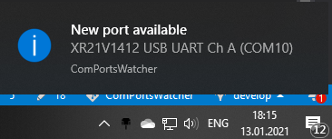
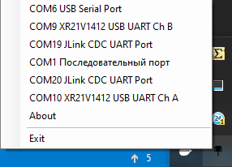
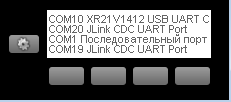

# ComPortsWatcher

Программа для мониторинга COM портов на компьютере.
При появлении COM порта появится всплывающее сообщение типа такого:

Также в трее висит иконка, пкм на которой выведет все доступные COM порты
без неообходимости лезть в диспетчер устройств:

При подключенной клавиатуре от Logitech с монохромным дисплеем, на дисплей
также выводится информация о подключенных портах:

Протестировано на клафиарутах:

* G13
* G510
* G510S

### Сборка

Проект писался, собирался, отлаживался через MS VS Community  2019.
Для сборки нужно склонировать проект, запустить "ComPortsWatcher.sln" из
корневого каталога.

Работает на .NET Framework 4.6

Дополнительно требуется "LogitechLcdEnginesWrapper.dll" для работы апплета
на дисплее клафиатур Logitech. Лежит в папке [libs](libs).
